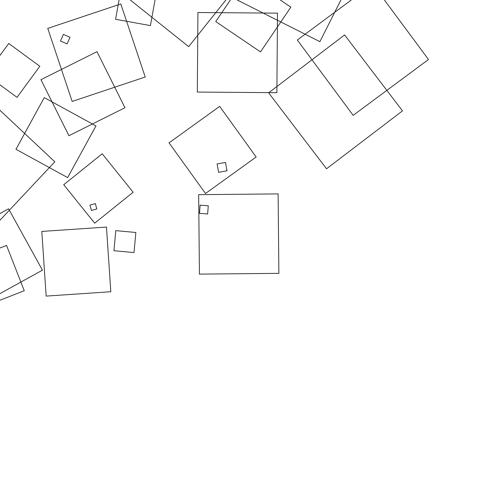
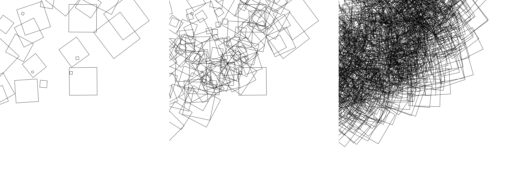

# Art Projects by [Randy Lubin](http://randylubin.com/) and [Avital Ungar](http://avitaltours.com/)

This repo contains the code for what will hopefully be an annual tradition of making code-generated art.

We use [p5js](https://p5js.org/) to create the art and then save and print the image.

## December 2016: Squares
For our first project, we experimented with procedural generation of squares on a canvas. We decided on transparent squares of varying widths with a thin border, clustered randomly in the upper part part of the canvas.

For the final product we decided on a triptych with the canvas at 60 loops, 350 loops, and 3000 loops. We tried many combinations before selecting the series to hang on our wall (seed 156).

The code for this project is in the [p5js](2016%20Transparent%20Squares) and licensed under the MIT License. That means you can use and remix the code as long as you give us credit.
